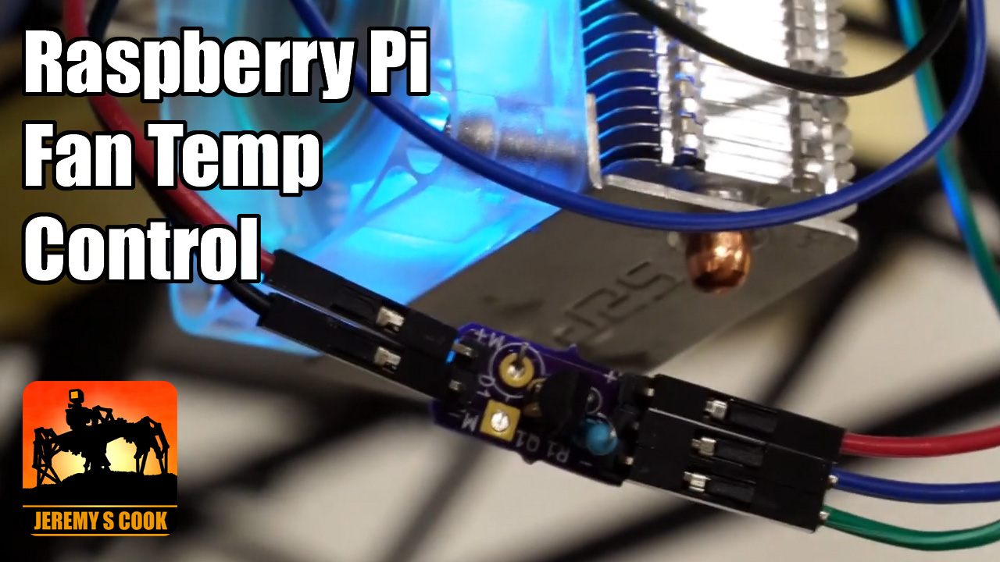

# RaspberryPi Temperture Fan Control
Control a Raspberry Pi fan based on temperature. Four Possible methods:

* **Raspbery Pi OS Control** [as outlined here](https://www.youtube.com/watch?v=AdjU_AVcZTA)
* **temp-fan.sh script** provided in this directory. May want to install the full version of Raspberry Pi OS (even when running headless) to ensure the proper GPIO functionality is available. Some discussion on the subject: https://github.com/JeremySCook/RaspberryPi-Fan-Control/issues/2
* **Python Script** [found here](https://github.com/JeremySCook/RaspberryPi-Fan-Control/blob/master/PythonScript/fantemp.py)
* **True PWM Control** allows you to run the fan at different speeds. [Outlined on Instructables](https://www.instructables.com/PWM-Regulated-Fan-Based-on-CPU-Temperature-for-Ras/) by Aerandir14. 

You can purchase the tiny EZ Fan2 control board on Tindie: https://www.tindie.com/products/jeremycook/ez-fan2-tiny-raspberry-pi-fan-controller/  
Note that the EZ Fan2 can be used for any small load up to a .6A limit (may need to de-rate in some situations) and fetures a flyback diode to help 
allieviate voltage spikes.

Further fan control/development info: https://www.youtube.com/watch?v=F1FQojoaNS8  
Control fan with Raspberry Pi OS: https://www.youtube.com/watch?v=AdjU_AVcZTA
Control 12V fan (or other load) with the EZ Fan2: https://www.youtube.com/watch?v=bBBTj0RP7F8

Items used in video:

ICE Tower: https://amzn.to/2N95qrn [Amazon]  
2N2222 Transistor: https://amzn.to/2AK2vTy [Amazon]  
Heat Shrink: https://amzn.to/2C8qf3Z [Amazon]  

*note that Amazon links are affiliate, meaning I get a percentage of sales

 
